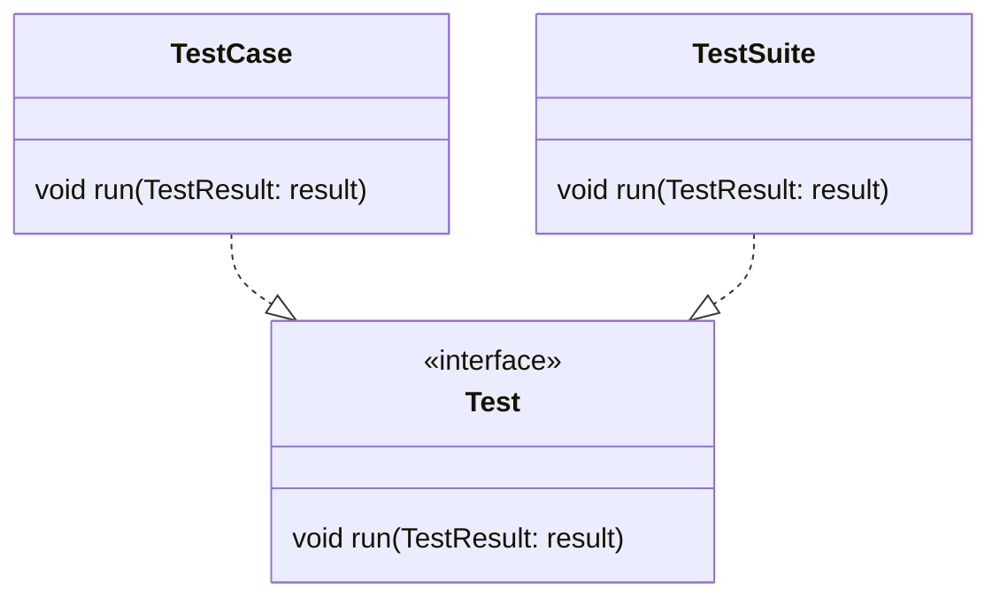
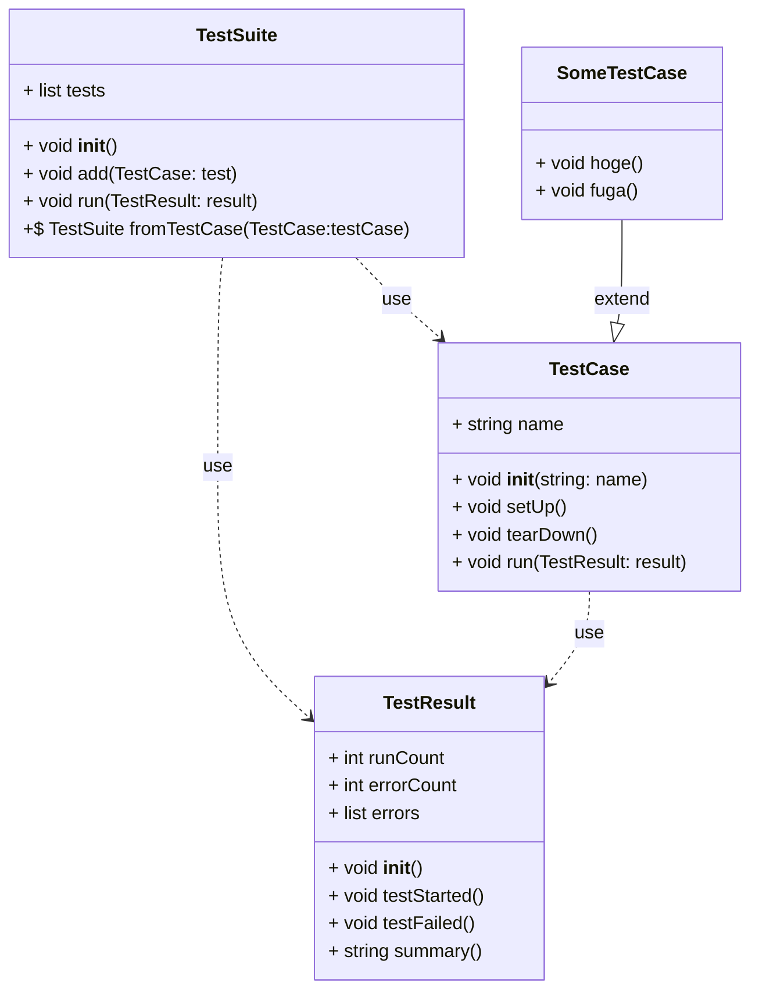

---

testBrokenのときにtearDownが呼ばれるか(通る)

```py
  # TestCaseTest
  def testTearDownOnBrokenMethod(self):
    test = WasRun("testBrokenMethod")
    test.run(self.result)
    assert test.log == "setUp testBrokenMethod tearDown "

  # WasRun
  def testBrokenMethod(self):
    self.log += "testBrokenMethod "
    raise Exception
```

---

```py

testFailedがこわれたとき(保険)

class BrokenTestResult(TestResult):
  def testFailed(self):
    raise Exception


  # TestCaseTest
  def testTearDownOnBrokenTestFailed(self):
    self.result = BrokenTestResult()
    test = WasRun("testBrokenMethod")
    try:
      test.run(self.result)
    except Exception:
      assert test.log == "setUp testBrokenMethod tearDown "
```


finallyでtearDownする
```py
  # TestCase
  def run(self, result):
    result.testStarted()
    self.setUp()
    try:
      method = getattr(self, self.name)
      method()
    except Exception:
      result.testFailed()
    finally:
      self.tearDown()
```

---

setupのテスト

```py
class WasRunSetUpBroken(TestCase):
  def setUp(self):
    self.log = "setUp "
    raise Exception


  # TestCaseTest
  def testTearDownOnBrokenSetUp(self):
    test = WasRunSetUpBroken("testMethod")
    test.run(self.result)
    assert self.result.summary() == "1 run, 1 failed\nErrors: WasRunSetUpBroken.setUp -- Exception"

```

---
setupのキャッチ

```py

class TestResult:
  def __init__(self):
    self.runCount = 0
    self.errorCount = 0
    self.errors = []

  def testStarted(self):
    self.runCount += 1

  def testFailed(self, errors=None):
    self.errorCount += 1

    if errors:
      self.errors.append(errors)

  def summary(self):
    return f"{self.runCount} run, {self.errorCount} failed" + (f"\nErrors: {','.join(self.errors)}" if self.errors else "")


  # TestCase
  def run(self, result):
    result.testStarted()
    try:
      self.setUp()
    except Exception as e:
      result.testFailed(errors=f"{self.__class__.__name__}.setUp -- {e.__class__.__name__}")
      return

    try:
      method = getattr(self, self.name)
      method()
    except Exception:
      result.testFailed()
    finally:
      self.tearDown()

```

---
ついでにテスト失敗側のフォーマット(フォーマットが変わるので落ちる)

```py
  def testFailedResult(self):
    test = WasRun("testBrokenMethod")
    test.run(self.result)
    assert self.result.summary() == "1 run, 1 failed\nErrors: WasRun.testBrokenMethod -- Exception"

  def testSuite(self):
    suite = TestSuite()
    suite.add(WasRun("testMethod"))
    suite.add(WasRun("testBrokenMethod"))
    suite.run(self.result)
    assert self.result.summary() == "2 run, 1 failed\nErrors: WasRun.testBrokenMethod -- Exception"
```

```py
  #TestCase
  def run(self, result):
    result.testStarted()
    try:
      self.setUp()
    except Exception as e:
      result.testFailed(errors=f"{self.__class__.__name__}.setUp -- {e.__class__.__name__}")
      return

    try:
      method = getattr(self, self.name)
      method()
    except Exception as e:
      result.testFailed(errors=f"{self.__class__.__name__}.{self.name} -- {e.__class__.__name__}")
    finally:
      self.tearDown()
```

---

TestCaseからTestSuite

```py
  def testSuiteFromTestCase(self):
    suite = TestSuite.fromTestCase(WasRun)
    result = TestResult()
    suite.run(result)
    assert result.summary() == "2 run, 1 failed\nErrors: WasRun.testBrokenMethod -- Exception"

```

```py
  @classmethod
  def fromTestCase(cls, testCase):
    suite = cls()
    for method in dir(testCase):
      if method.startswith("test"):
        suite.add(testCase(method))
    return suite
```

```py
if __name__ == "__main__":
  suite = TestSuite.fromTestCase(TestCaseTest)
  result = TestResult()
  suite.run(result)
  print(result.summary())
```